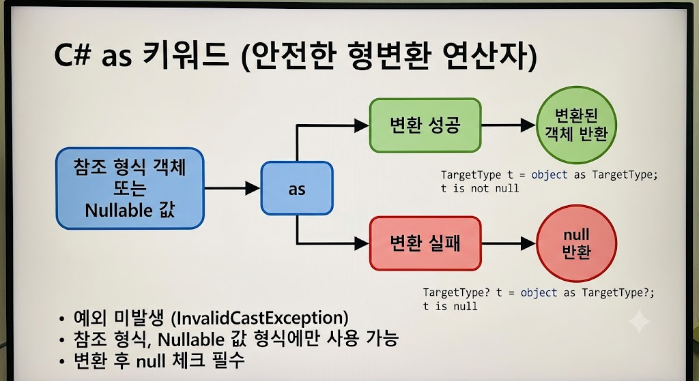

# [As](../KeywordsList.md)

</img>

| **구분** | **내용** |
| --- | --- |
| **정의** | 객체를 지정된 형식으로 안전하게 변환하는 캐스팅 연산자 |
| **기능** | 변환 성공 시 변환된 객체 반환, 실패 시 `null` 반환 |
| **적용 대상** | 참조 형식 및 Nullable 값 형식 (`int?` 등) |
| **예외 여부** | `InvalidCastException` 예외를 발생시키지 않음 |
| **장점** | 예외 처리(try-catch) 비용 없이 안전하고 빠르게 형변환 가능 |
| **단점 및 제한** | 일반 값 형식(`int`, `bool` 등)에는 사용 불가능 |
| **대안 (최신 C#)** | C# 7.0 이상의 `if (obj is TargetType target)` 패턴 매칭 구문 |

## 정의

- 형식 변환(Type Casting)을 수행할 때 사용되는 안전한 형변환 연산자
- 참조 형식(Reference Type) 또는 null 허용 값 형식(Nullable Value Type) 간의 형변환을 시도하고, 변환에 실패하더라도 예외(Exception)를 발생시키는 대신 `null`을 반환하는 연산자

```csharp
// 기본 구문
목표형식 변수명 = 피연산자 as 목표형식;
```

## 기능

- **안전한 형변환 :** 캐스팅 시 올바른 형식이 아니더라도 `InvalidCastException` 예외를 발생시키지 않고 안전하게 `null` 처리할 수 있음.
- **조건부 객체 접근 :** 변환 결과가 `null`인지 확인(`if (result != null)`)한 후 객체의 멤버에 안전하게 접근하는 패턴으로 자주 활용됨.

## 특징

- **예외 미발생 :** 명시적 형변환 `(TargetType)obj`은 변환 실패 시 예외가 발생해 프로그램이 중단될 수 있지만, `as` 연산자는 `null`만 반환함.
- **대상 형식의 제한 :** `null` 값을 가질 수 있는 형식에만 사용할 수 있음.
    - **사용 가능 :** 클래스, 인터페이스, 대리자(Delegate), 배열, Nullable 값 형식(`int?`, `DateTime?` 등)
    - **사용 불가 :** 일반 값 형식(`int`, `float`, `struct` 등 non-nullable value types)
- **성능상의 이점 :** `is` 연산자로 타입을 확인한 후 명시적 형변환을 두 번 진행하는 것보다, `as` 연산자로 한 번에 변환 후 `null` 체크를 하는 편이 내부적인 타입 검사를 한 번만 수행하므로 더 효율적.

## 알아두면 좋을 내용

### 명시적 캐스팅 vs `as` 연산자 비교

```csharp
object obj = "Hello, C#";

// 1. 명시적 형변환 (실패 시 InvalidCastException 발생)
try
{
    int num = (int)obj; // 예외 발생!
}
catch (InvalidCastException ex)
{
    Console.WriteLine("형변환 실패!");
}

// 2. as 연산자 (실패 시 null 반환)
string str = obj as string; // 성공: "Hello, C#"
int? nullableInt = obj as int?; // 실패: null 반환 (예외 발생 안 함)

if (str != null)
{
    Console.WriteLine($"문자열 길이: {str.Length}");
}
```

### `is` 패턴 매칭

- `is` 키워드가 선언 패턴(Pattern Matching)을 지원하면서 `as` 키워드 사용 빈도가 줄어듦.
- 기존 `as` 활용 패턴 :

```csharp
MyClass myObj = obj as MyClass;
if (myObj != null)
{
    myObj.DoSomething();
}
```

- `is` 패턴 매칭 :

```csharp
if (obj is MyClass myObj)
{
    myObj.DoSomething(); // 타입 검사와 변수 할당이 동시에 이루어짐
}
```