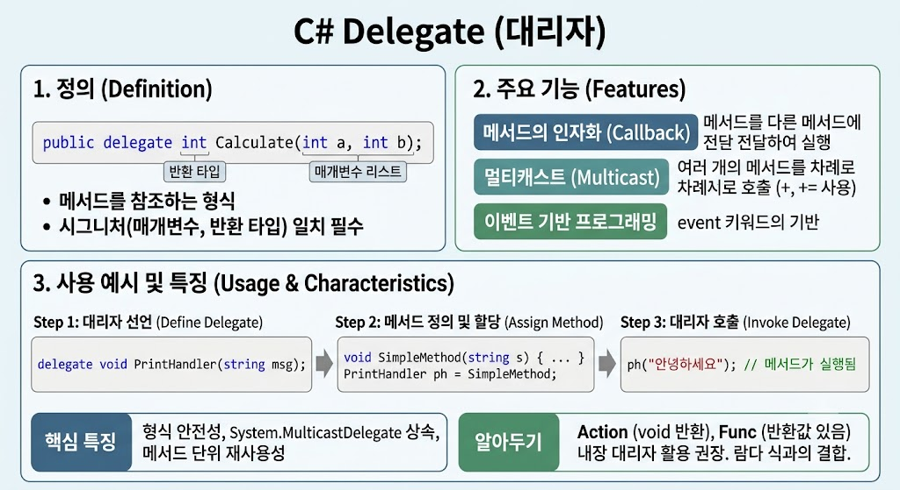

# [Delegate](../KeywordsList.md)

</img>

| **구분** | **내용** |
| --- | --- |
| **정의** | 메서드 참조를 관리하는 형식 안전한 함수 포인터 개체 |
| **주요 역할** | 콜백 구조 구현, 이벤트 처리, 메서드의 매개변수 전달 |
| **핵심 특징** | Type-safe, 멀티캐스트 지원(`+=`), `System.MulticastDelegate` 상속 |
| **현대적 활용** | `Func`, `Action` 내장 대리자 및 **람다 식(Lambda)**과 함께 주로 사용 |

## 정의

- 메서드에 대한 참조를 안전하게 캡슐화하는 형식 안전한(Type-safe) 함수 포인터
- 메서드 자체를 변수처럼 넘기거나, 인자로 전달하고, 반환값으로 활용할 수 있게 해줌
- 메서드의 반환 타입과 매개변수 목록(시그니처)을 정의하는 참조 타입(Reference Type) 선언
- 선언된 대리자 형식과 동일한 매개변수 구조 및 반환 타입을 가진 메서드만 해당 대리자에 등록할 수 있음

```csharp
// int 매개변수 2개를 받고 int를 반환하는 메서드를 참조할 수 있는 대리자 선언
public delegate int Calculate(int a, int b);
```

## 기능

- **메서드의 인자화 (Callback 구현):** 메서드를 다른 메서드의 매개변수로 전달하여 특정 작업이 끝난 후 호출되도록 하는 콜백 구조를 쉽게 만들 수 있음.
- **멀티캐스트 (Multicast):** `+` 또는 `+=` 연산자를 사용해 하나의 대리자에 여러 개 이상의 메서드를 체인 형태로 연결할 수 있음. 호출 시 등록된 순서대로 메서드들이 연속 실행됨.
- **이벤트 기반 프로그래밍 (Event Handling):** C#의 `event` 키워드의 기반이 되며, 사용자 입력, 데이터 변화 등의 이벤트를 알리고 수신하는 구조를 제공함.

## 특징

- **형식 안전성 (Type Safety):** C/C++의 함수 포인터와 달리, 컴파일 타임에 대리자의 시그니처와 대상 메서드의 시그니처가 완전히 일치하는지 검증하므로 안전함.
- **클래스 기반 동작:** `delegate` 키워드로 선언하면 컴파일러가 내부적으로 `System.MulticastDelegate` 클래스를 상속받는 클래스로 변환함.
- **인스턴스 및 정적 메서드 지원:** 객체의 인스턴스 메서드와 클래스의 static 메서드 구분 없이 모두 참조할 수 있음.

## 알아두면 좋을 내용

#### 내장 대리자 (Func, Action)

- 매번 `delegate` 키워드로 새로운 대리자 타입을 선언하지 않아도 되도록 C#은 generic 형태의 내장 대리자를 제공함.
    - **`Action`** : 반환값이 없는(`void`) 메서드 참조 (`Action<T1, T2>`)
    - **`Func`** : 반환값이 있는 메서드 참조 (`Func<T1, T2, TResult>` - 마지막 인자가 반환 타입)

#### 무명 메서드와 람다 식 (Lambda Expressions)

대리자를 사용할 때 별도의 메서드를 정의하지 않고 식이나 블록 형태로 간결하게 작성할 수 있음.

```csharp
// Func 내장 대리자 + 람다 식 활용
Func<int, int, int> add = (a, b) => a + b;
int result = add(3, 5); // 8
```

#### delegate vs event

- **delegate** : 외부 클래스에서 직접 호출(`Invoke`)하거나 내용을 임의로 대입(`=`)하여 초기화할 수 있음.
- **event** : `delegate`를 캡슐화한 것으로, 외부 클래스에서는 오직 등록(`+=`) 및 해제(`=`)만 가능하여 객체 간 안전한 이벤트 전달에 사용됨.