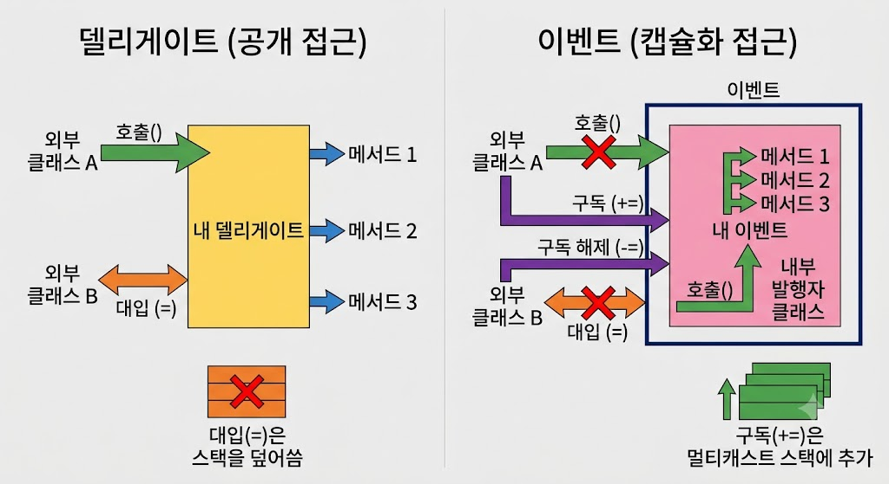

# [Delegate Vs Event](../KeywordsList.md)

</img>

| **구분** | **Delegate (대리자)** | **Event (이벤트)** |
| --- | --- | --- |
| **개념** | 메서드 참조를 담는 형식(Type) 또는 객체 | Delegate를 기반으로 동작하는 접근 제한자(특수 래퍼) |
| **외부 접근 권한** | 외부 클래스에서 직접 호출 및 할당(`=`) 가능 | 외부 클래스에서 구독(`+=`) 및 해제(`-=`)만 가능 |
| **외부 호출 여부** | 외부 클래스에서 `delegate()` 직접 호출 가능 | 선언된 클래스 내부에서만 호출 가능 |
| **주 사용 목적** | 콜백 함수 전달, LINQ, 람다 식, 함수 매개변수 | 객체 상태 변화 알림, UI 이벤트 처리 (발행-구독 패턴) |

## 1. 외부에서 직접 호출 제한

- **Delegate** : delegate 변수를 가지고 있다면, 선언된 클래스 외부에서도 해당 Delegate를 직접 실행(호출)할 수 있음.
- **Event :** 이벤트는 오직 이벤트를 정의한 클래스 내부에서만 호출할 수 있음. 외부 클래스가 함부로 이벤트를 발생시키는 남용을 방지.

## 2. 대입 연산자(`=`) 사용 제한 (캡슐화 보호)

- **Delegate :** 외부에서 `=` 연산자를 사용해 대입할 수 있음. 하지만 이 경우 기존에 등록되어 있던 다른 콜백 메서드들이 전부 덮어씌워져 삭제되는 위험이 있음.
- **Event :** 외부에서 `=` 대입 연산자 사용이 금지되며, 오직 `+=` (구독) 및 `=` (구독 해제) 연산자만 사용할 수 있음. 기존 구독자를 실수로 삭제하는 사고를 문법적으로 막아줌

```csharp
public class Button
{
    // 1. Delegate 공개 변수
    public Action OnClickDelegate;

    // 2. Event 선언 (Delegate를 event 키워드로 감쌈)
    public event Action OnClickEvent;

    public void Push()
    {
        // 내부에서는 둘 다 호출 가능
        OnClickDelegate?.Invoke();
        OnClickEvent?.Invoke();
    }
}

public class Program
{
    static void Main()
    {
        Button btn = new Button();

        // --- [Delegate 동작] ---
        btn.OnClickDelegate = MyMethod1;
        btn.OnClickDelegate = MyMethod2; // 위험: MyMethod1이 덮어씌워져 삭제됨!
        btn.OnClickDelegate();           // 위험: 외부에서 직접 호출 가능!

        // --- [Event 동작] ---
        btn.OnClickEvent += MyMethod1;
        btn.OnClickEvent += MyMethod2;  // 안전: 기존 구독을 유지하며 추가됨
        
        // btn.OnClickEvent = MyMethod2; // ❌ 컴파일 에러! (= 대입 불가)
        // btn.OnClickEvent();          // ❌ 컴파일 에러! (외부 호출 불가)
    }

    static void MyMethod1() => Console.WriteLine("버튼 클릭 1");
    static void MyMethod2() => Console.WriteLine("버튼 클릭 2");
}
```

## 언제 무엇을 사용할까?

- **Delegate를 쓸 때:**
    - 메서드를 다른 메서드의 매개변수로 전달해야 할 때 (`Func<>`, `Action<>` 등)
    - 반환값이 있는 콜백 처리가 필요할 때
- **Event를 쓸 때:**
    - UI 클릭, 데이터 변경, 작업 완료 등 **"**어떤 사건이 발생했음"을 여러 객체에 알릴 때 (Publish-Subscribe 패턴)
    - 외부 객체가 함부로 상태를 변경하거나 이벤트를 강제로 발생시키지 못하게 안전하게 제한하고 싶을 때