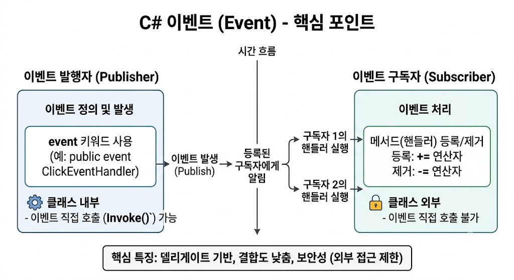

# [Event](../KeywordsList.md)

</img>

| **구분** | **내용** |
| --- | --- |
| **정의** | 객체 내 특정 사건의 발생을 외부에 알리는 델리게이트 기반의 메커니즘 |
| **기능** | 객체 간 메시지/상태 전파, 구독 등록(`+=`) 및 해제(`-=`), 비동기적 콜백 실행 |
| **특징** | • 발행-구독(Pub-Sub) 패턴으로 객체 간 느슨한 결합 유지<br>• 외부에서는 구독/해제만 허용, 직접 호출 및 초기화 불가 (캡슐화)<br>• 다중 메서드 등록 가능 (Multicast) |
| **권장 사항** | • 사용자 정의 델리게이트 대신 `EventHandler<TEventArgs>` 활용<br>• 메모리 누수를 방지하기 위한 이벤트 해제(`-=`) 필수<br>• `?.Invoke()` 형태를 사용한 Null-safe 호출 |

## 정의

- 특정 사건(버튼 클릭, 데이터 수신 완료 등)이 일어났을 때 이를 알리기 위한 델리게이트(Delegate) 기반의 특별한 캡슐화 객체
- 클래스나 객체에서 특정 사건이 발생했음을 외부에 알리는(Notification) 메커니즘
- 발행-구독(Publish-Subscribe) 패턴을 기반으로 작동하며, 객체 간의 결합도(Coupling)를 낮추는 데 매우 유용한 기능

```csharp
// 간단한 이벤트 선언 구조
public class Button
{
    // 1. 델리게이트 선언 (또나 EventHandler 활용)
    public delegate void ClickEventHandler();

    // 2. event 키워드를 사용한 이벤트 선언
    public event ClickEventHandler Clicked;

    // 3. 이벤트 발생 메서드
    public void Click()
    {
        // 구독자가 있을 때만 실행
        Clicked?.Invoke();
    }
}
```

## 기능

- **동작 원리** : 이벤트 발행자(Publisher)는 이벤트의 발생을 알리고, 이벤트 구독자(Subscriber)는 이벤트가 실행될 때 호출될 메서드(이벤트 핸들러)를 등록.
    - **상태 변화 알림** : 객체의 특정 상태나 행동(UI 클릭, 네트워크 수신, 타이머 만료 등)을 다른 객체에 즉시 전파.
    - **콜백(Callback) 매커니즘** : 구독자는 발생 시점에 비동기적으로 실행될 실행 로직(메서드)을 사전에 등록할 수 있음.

## 특징

- **델리게이트(Delegate) 기반 :** 이벤트는 내부적으로 델리게이트 객체를 캡슐화하여 사용함. 따라서 델리게이트와 일치하는 시그니처(반환 타입, 매개변수)를 가진 메서드만 등록할 수 있음.
- **엄격한 캡슐화 및 보안성 (델리게이트와의 차이점)**
    - 클래스 외부에서는 오직 이벤트 추가(`+=`) 및 제거(`=`) 연산만 가능.
    - 클래스 외부에서 이벤트를 직접 호출(`Invoke()`)하거나 초기화(`= null`)할 수 없음.
- **다중 대상 전송 (Multicast) :** 하나의 이벤트에 여러 개의 구독자(메서드)를 등록할 수 있으며, 이벤트가 발생하면 등록된 모든 메서드가 순차적으로 실행됨.

## 알아두면 좋을 내용

- **표준 EventHandler 패턴 사용 :** C# 표준 라이브러리는 매번 델리게이트를 새로 정의하지 않고 표준 형태의 이벤트를 작성할 수 있도록 `EventHandler` 및 `EventHandler<TEventArgs>` 델리게이트를 제공.

```csharp
public class CustomEventArgs : EventArgs
{
    public string Message { get; set; }
}

public class Publisher
{
    // 표준 EventHandler<T> 활용
    public event EventHandler<CustomEventArgs> DataProcessed;

    public void DoWork()
    {
        // 작업 수행 후 이벤트 발생
        DataProcessed?.Invoke(this, new CustomEventArgs { Message = "작업 완료!" });
    }
}
```

- **메모리 누수(Memory Leak) 유의**
    - 구독자 객체가 발행자 이벤트에 메서드를 등록(`+=`)한 뒤, 해제(`=`)하지 않으면 발행자가 참조를 유지하게 되어 GC(가비지 컬렉터)가 구독자를 수거하지 못함.
    - 더 이상 이벤트를 받을 필요가 없거나 구독자 객체가 파괴될 때는 반드시 이벤트를 해제해야 함.
- **Thread Safety (안전한 호출) :** .NET 6 이상 및 C# 6.0 이후부터는 null 조건 연산자(`?.`)를 활용하여 안전하게 이벤트를 실행할 수 있음.

```csharp
// 안전한 호출 (Null-check Thread Safety)
MyEvent?.Invoke(this, EventArgs.Empty);
```