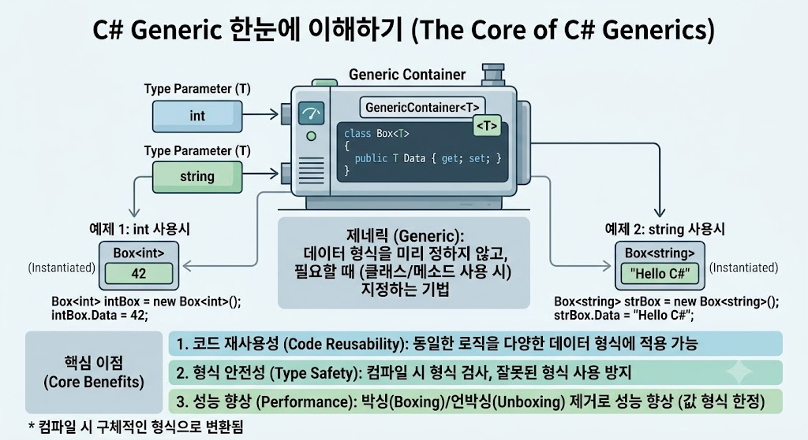

# [Generic](../KeywordsList.md)

</img>

| **구분** | **주요 내용** | **유니티 및 C# 예시** |
| --- | --- | --- |
| **정의** | 타입을 매개화하여 범용적이고 안전한 코드를 작성하는 기능 | `List<T>`, `Dictionary<T, U>` |
| **성능 최적화** | 값 형식의 박싱/언박싱을 제거해 가비지 컬렉션(GC) 부하 감소 | 프레임 드랍 방지 및 연산 속도 향상 |
| **제약 조건** | `where` 키워드를 이용해 허용할 타입의 조건을 강제 | `where T : Component` |
| **실무 활용** | 컬렉션 관리, 컴포넌트 탐색, 공통 로직(싱글톤 등) 모듈화 | `gameObject.GetComponent<T>()` |

## 정의

- 코드의 재사용성을 높이고 타입 안정성을 보장하기 위해 데이터 타입을 일반화하는 기능
- 클래스, 구조체, 인터페이스, 메서드 등에서 사용될 데이터 타입을 미리 고정하지 않고, 실제 사용할 때 타입 매개변수(`T`)를 전달받아 처리

## 기능

- **타입 매개변수 (`<T>`) :** 코드를 작성할 때는 임의의 타입 심볼(`T`)을 사용하고, 객체를 생성하거나 메서드를 호출할 때 실제 타입(`int`, `string`, 사용자 정의 클래스 등)을 대입.
- **타입 안정성(Type Safety) :** 컴파일 타임에 타입을 엄격하게 검사하므로 잘못된 타입이 들어오는 것을 사전에 방지하며, 명시적인 형변환(Casting) 코드가 줄어듦.
- **박싱(Boxing) 및 언박싱(Unboxing) 방지 :** `object` 타입으로 데이터를 다루면 값 형식이 힙(Heap)에 할당되는 성능 저하가 발생함. 제네릭은 해당 타입 전용 코드를 기계어로 생성하므로 값 형식 처리 시 메모리 할당과 성능 손실이 없음.

## 특징

- **코드 중복 제거 :** 동일한 알고리즘이나 자료구조(예: `List<T>`, `Dictionary<TKey, TValue>`)를 타입별로 여러 개 만들 필요 없이 하나로 통합 관리할 수 있음.
- **제약 조건 (`where` 절) :** 타입 매개변수가 가질 수 있는 조건의 범위를 지정할 수 있음. 예를 들어 `where T : class`(참조 형식 제한), `where T : struct`(값 형식 제한), `where T : new()`(기본 생성자 존재 제한) 등을 통해 안정성을 높임.

## 코드 실전 활용

- **유니티 `GetComponent<T>()`** : 유니티에서 가장 대표적으로 쓰이는 제네릭 메서드로, 오브젝트의 컴포넌트를 형변환 없이 안전하고 직관적으로 가져옴.
- **싱글톤 패턴 구현 :** `public class Singleton<T> : MonoBehaviour where T : MonoBehaviour` 형태로 제네릭 싱글톤 구조를 만들면 매니저 클래스마다 중복 코드를 작성할 필요가 없음.
- **공변성(`out`)과 반공변성(`in`) :** 인터페이스나 델리게이트 선언 시 타입 매개변수의 상속 관계 호환성을 조절하여 더 유연한 설계가 가능함.