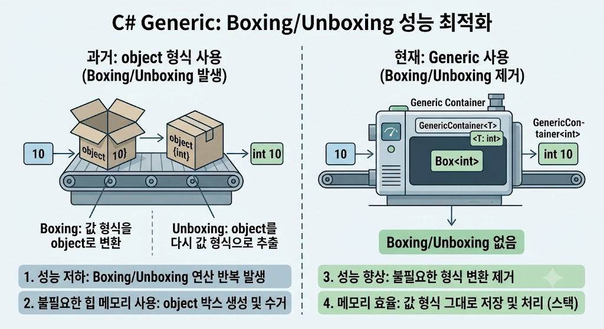

# [Generic을 통한 Boxing/Unboxing 방지 효과](../KeywordsList.md)

</img>

### **제네릭 이전의 컬렉션과 박싱(Boxing)**

C#에서 `ArrayList`와 같은 구형 컬렉션은 모든 데이터를 최상위 부모인 `object` 타입으로 처리했음. 정수(`int`)나 구조체(`struct`) 같은 **값 형식(Value Type)** 데이터를 저장할 때, 값을 힙(Heap) 메모리에 객체로 감싸는 박싱(Boxing)이 발생함. 반대로 저장된 값을 꺼내 쓸 때는 원래의 값으로 되돌리는 언박싱(Unboxing)이 일어남. 이 과정은 매번 힙 메모리 할당, 포인터 참조, 그리고 타입 캐스팅 연산을 수반하여 심각한 성능 저하를 유발.

### **제네릭(Generics)을 통한 해결 방식**

제네릭(`List<T>` 등)을 사용하면 데이터 타입을 컴파일 시점에 확정할 수 있어 이러한 문제가 원천적으로 해결됨.

- **타입 안전성 확보 :** 컴파일러가 사용할 타입을 미리 알 수 있기 때문에 잘못된 타입의 데이터가 들어오는 것을 막고 불필요한 캐스팅 코드를 제거함.
- **JIT 컴파일러의 타입 특수화(Specialization) :** `.NET` 런타임의 JIT 컴파일러는 `List<int>`를 만나면 `int` 전용으로 최적화된 내부 코드를 별도로 생성. 값 형식이 `object`로 변환되지 않고, 메모리상에 `int` 데이터가 연속으로 직접 배치됨.

### **성능 및 메모리 최적화 효과**

- **힙 메모리 할당 제거 :** 값 형식을 다룰 때 힙 메모리에 객체를 생성하지 않고 스택(Stack) 또는 메모리 버퍼에 직접 저장되므로 메모리 단편화를 방지함.
- **가비지 컬렉터(GC) 부하 감소 :** 박싱 과정에서 생성되는 임시 객체들이 사라지므로, 힙 메모리를 정리해야 하는 GC의 작업량이 극적으로 줄어듦.
- **CPU 연산 비용 절감 :** 언박싱 시 수반되는 내부적인 타입 검증(Type Check)과 데이터 복사 비용이 발생하지 않는다.