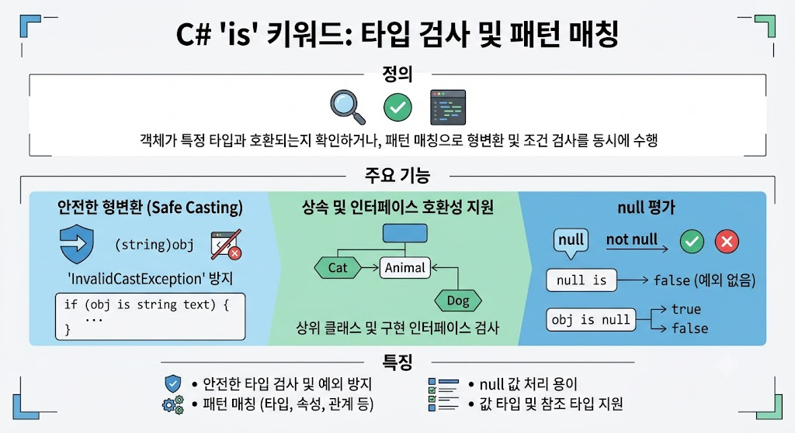

# [Is](../KeywordsList.md)

</img>

| **항목** | **핵심 내용** |
| --- | --- |
| **정의** | 객체가 특정 타입 또는 패턴과 일치하는지 검사하는 연산자 |
| **기본 역할** | 타입 호환성 검사 (`true` / `false` 반환) |
| **주요 기능** | - 타입 검사 및 안전한 형변환<br>- `null` 및 `not null` 검사<br>- 속성, 관계, 논리 패턴 매칭 |
| **핵심 특징** | - `null` 대상 검사 시 예외 없이 `false` 반환<br>- 상속 관계 및 인터페이스 구현체 모두 인식<br>- 잘못된 캐스팅 예외(`InvalidCastException`) 방지 |
| **비교 (`as`)** | `is`는 패턴 검사 및 변수 생성 / `as`는 실패 시 `null`을 반환하는 참조 형변환 |

## 정의

- 객체가 특정 타입과 호환되는지 확인하거나, 패턴 매칭(Pattern Matching)을 통해 객체의 형변환 및 조건검사를 한 번에 처리할 때 사용하는 연산자

## 기능

- **타입 검사 (Type Checking) :** 어떤 객체가 주어진 타입으로 형변환(Casting)이 가능한지 연산하여 `bool` 값(`true` 또는 `false`)을 반환.
- **패턴 매칭 (Pattern Matching) :** 타입을 검사하는 동시에 조건이 맞으면 새로운 변수로 바로 할당(형변환)해 줌. C# 버전이 올라감에 따라 위치 패턴, 속성 패턴, 관계 패턴 등 다양한 패턴과 함께 사용할 수 있게 확장됨.

## 특징

- **안전한 형변환 :** 잘못된 형변환으로 인해 발생할 수 있는 `InvalidCastException` 예외를 방지.
- **상속 및 인터페이스 호환성 지원 :** 객체의 정확한 클래스 타입뿐만 아니라, 상위 클래스(부모 타입)나 구현한 인터페이스에 대해서도 `true`를 반환.
- **`null` 평가 :** 검사 대상 객체가 `null`인 경우 예외를 발생시키지 않고 항상 `false`를 반환.
- **값 타입(Struct)과 참조 타입(Class) 모두 지원 :** 박싱/언박싱 상황이나 `Nullable` 타입 검사 시에도 유용하게 동작.

## 알아두면 좋을 내용

- **`as` 연산자와의 차이점:**
    - `is` : 형변환 가능 여부를 `bool`로 반환하며, 패턴 매칭 변수를 만들 수 있음.
    - `as` : 형변환을 시도하고, 실패하면 예외 대신 `null`을 반환. (값 타입에는 직접 사용할 수 없음)
- **성능 및 컴파일러 최적화 :**
과거에는 `if (obj is TargetType) { TargetType t = (TargetType)obj; }` 처럼 검사 후 재형변환을 하여 형변환 연산이 2번 일어났지만, C# 7.0의 `is TargetType t` 패턴을 사용하면 내부적으로 1번의 형변환 작업만 수행되므로 가독성과 성능 모두 향상됨.

### 주요 문법

1.  **타입 선언 패턴 (Type Pattern)**
    - 가장 기본적인 형태로, 타입을 확인하고 즉시 변수로 변환하여 사용하는 방식

```csharp
object obj = "Hello, C#";

// C# 7.0 이후: 타입 검사 + 형변환 + 변수 할당을 동시에 진행
if (obj is string text)
{
    // obj가 string이면 text 변수로 사용할 수 있으며, true 블록 안에서 유효합니다.
    Console.WriteLine($"문자열 길이: {text.Length}");
}
```

1. null 검사 패턴 (`is null` / `is not null`)
    - `null`을 명확하게 가독성 높은 방식으로 검사할 수 있습니다. `== null` 연산자 오버로딩의 영향을 받지 않는 장점이 있음

```csharp
string name = GetName();

if (name is not null)
{
    Console.WriteLine(name.ToUpper());
}
```

1. 속성 및 관계 패턴(Property & Relational Pattern)
    - 객체의 내부 속성값이나 특정 수식 조건을 결합하여 검사할 수 있음.

```csharp
// 속성 패턴
if (person is Student { Age: >= 20 } adultStudent)
{
    Console.WriteLine($"성인 학생: {adultStudent.Name}");
}

// 관계 및 논리 패턴 (C# 9.0+)
int number = 15;
if (number is > 10 and < 20)
{
    Console.WriteLine("10보다 크고 20보다 작은 수입니다.");
}
```