# [U03_Vector](../UnityStudy_List.md)

## 벡터

- 방향과 크기를 가짐(화살표)
- 그래픽스에서는 동차라는 공간이 있어 이걸 좌표로 표현함
- 위치벡터 / 방향벡터 가 있음
- 향하는 방향 : (-) 을 많이 씀
    
    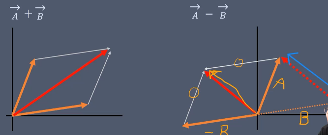</img>
    
    - A위치 + B위치 = C위치
    - A위치 - B위치 = B→A 방향 | 크기 = 두 위치 사이의 거리
    - 정규화(Normalized Vector) : 방향 벡터의 크기로 나눠서 크기를 1로 만드는 거 : 크기가 1인 벡터(단위 벡터) 만듦
    - A위치 + (B위치 - C위치)*배수 : A의 위치에서 시작하는 B가 C를 향하는 방향으로의 배수 크기 벡터

## 01_Add

```csharp
private Vector2 value1 = new Vector2(1, 2); //A위치
private Vector2 value2 = new Vector2(2, 3); //B위치

Vector2 result = value1 + value2;
```

시작 위치인 A의 위치와 두 벡터의 합인 result를 OnDrawGizmos를 이용해 표시

- OnDrawGizmos : 씬 뷰(Scene View)에 디버깅 및 시각화용 기즈모(Gizmo)를 그릴 때 사용하는 콜백 함수
    - 게임 실행 중이 아니더라도 에디터 상에서 상시 실행되어 콜라이더 범위, 이동 경로, AI 인지 거리 등을 화면에 직관적으로 표시할 때 유용
    
    | **함수** | **동작 시점** | **주요 용도** |
    | --- | --- | --- |
    | **`OnDrawGizmos`** | 씬에 있는 해당 오브젝트가 활성화되어 있다면 항상 그림 | 상시 확인이 필요한 구역, 맵 경계, 스폰 지점 표시 |
    | **`OnDrawGizmosSelected`** | 해당 오브젝트를 마우스로 선택했을 때만 그림 | 복잡한 씬에서 특정 오브젝트의 세부 범위/경로를 깔끔하게 확인 |

```csharp
private void OnDrawGizmos()
{
    GUIStyle style = GUIStyle.none; //투명한(배경과 테두리가 없는) 기본 GUI 스타일 객체를 생성
    style.normal.textColor = Color.white;//텍스트의 글자 색을 흰색으로 지정
    style.alignment = TextAnchor.MiddleCenter;//텍스트의 정렬을 중앙 정렬로 지정
    Handles.Label(value1, value1.ToString(), style);
    //value1 위치에 value1의 값을 문자열로 바꾼 텍스트 라벨을 위에서 만든 style을 적용하여 씬 뷰에 표시
    ...
    Handles.Label(result, result.ToString(), style);
    //result 위치에 result의 값을 문자열로 바꾼 텍스트 라벨을 위에서 만든 style을 적용하여 씬 뷰에 표시

    Gizmos.color = Color.red;//기즈모의 색상을 빨간색으로 지정
    //Gizmos.DrawLine(value1, value2);
    Gizmos.DrawLine(value1, result);//value1부터 result까지 직선을 그림
}
```
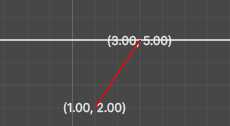</img>

## 02_Minus

```csharp
private Vector2 value1 = new Vector2(4,3); //A위치
private Vector2 value2 = new Vector2(2,1); //B위치

Vector2 result = value1 - value2;
```

- value1 - value2 = value2에서 value1을 바라보는 방향과 크기

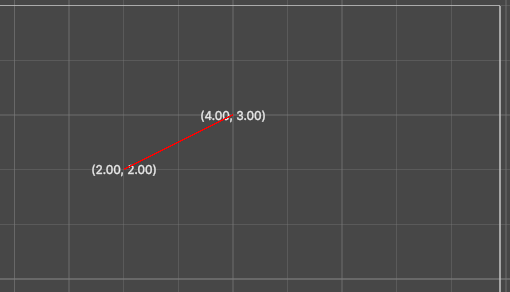</img>

## 03_Direction

```csharp
private float length = 1.0f;

Vector2 value1 = new Vector2(0,1); //A 위치
Vector2 value2 = new Vector2(0,0); //B 위치
Vector2 result = value1 - value2;
print($"result의 크기 : {result.magnitude});//magnitude: returns length of this Vector
Gizmos.color = Color.green;
Gizmos.DrawLine(new Vector2(0, 0), result);
```

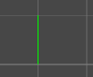</img>

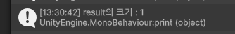</img>

```csharp
Vector2 position = transform.position;
Vector2 result2 = position + result;

Gizmos.color = Color.red;
Gizmos.DrawLine(position, result2);
```

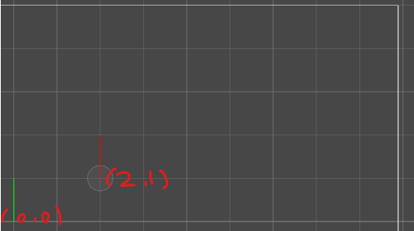</img>

- Direction 게임 오브젝트의 transform.position은 (2, 1), result는 y축방향으로 크기가 1인 벡터이므로 (2, 1)에서 (0, 1) 방향으로 빨간 기즈모가 그려짐

```csharp
Vector2 result3 = (value1 - value2).normalized * length;
//normalized : 크기가 1이지만 방향은 현재 벡터와 동일한 벡터를 return/현재 벡터의 크기가 너무 작으면 0을 반환

Gizmos.color = Color.yellow;
Gizmos.DrawLine(new Vector2(0, 0), result3);
```

- value1-value2는 value2 → value1을 향하는 벡터를 정규화 * length = value2 → value1을 향하는 length크기의 벡터

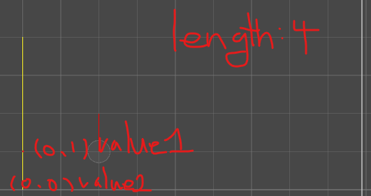</img>

## 04_Normalize

- Normalized 벡터 : 벡터의 길이를 1로 만드는 것 ⇒ 방향만 존재하는 벡터

```csharp
private GameObject target;
private float length = 1.0f;

private void OnDrawGizmos()
{
    Vector2 value1 = transform.position;//transform은 GetComponent로 가져오지 않아도 되는 유일한 컴포넌트
    Vector2 value2 = target.transform.position;

    
    GUIStyle style = GUIStyle.none;
    style.normal.textColor = Color.white;
    style.alignment = TextAnchor.MiddleCenter;

    Handles.Label(value1, value1.ToString(), style);

    Vector2 result = value2 - value1; //value1 -> value2
    result.Normalize();//크기를 1로 정규화 => 단위벡터

    Handles.Label(result, result.ToString(), style);

    Gizmos.color = Color.green;
    Gizmos.DrawLine(value1, result * length);//단위벡터에 크기를 곱한 것
}
```

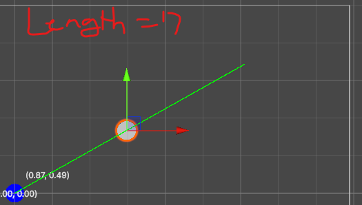</img>

- target인 흰 원을 향하는 방향으로 파란 원(value 1)에서 단위벡터의 좌표가 나타남.
- length를 곱하면 단위벡터가 향하는 방향으로 크기만큼 초록색 기즈모가 그려짐

## 05_Shoot

- 벡터가 향하는 방향으로 총알을 발사
- 총알은 Prefab으로 저장(물리의 영향을 받으니 Rigidbody 2D를 부여)

```csharp
private GameObject target; //총알을 맞출 타겟
private float length = 1.0f; //크기

private void Update()
{
    if(Input.GetKeyDown(KeyCode.Space))//스페이스바가 눌리면
    {
        GameObject obj = Instantiate<GameObject>(prefab);//총알 프리팹을 복제해서 obj에 저장
        Rigidbody2D rigid = obj.GetComponent<Rigidbody2D>();//복제한 총알 프리팹의 rigidbody를 가져옴

        Vector2 value1 = transform.position;//나의 위치
        Vector2 value2 = target.transform.position;//타겟의 위치
        
        Vector2 direction = value2 - value1;//나에서 타겟을 향하는 방향으로
        direction.Normalize();//단위벡터를 반들어줌

        rigid.AddForce(direction * length);//단위벡터 방향에 length를 곱한 힘만큼 복제 총알 프리팹에 힘을 가함
        Destroy(obj, 3.0f);//발사된 총알은 3.0f초 뒤에 사라짐
    }
}
```

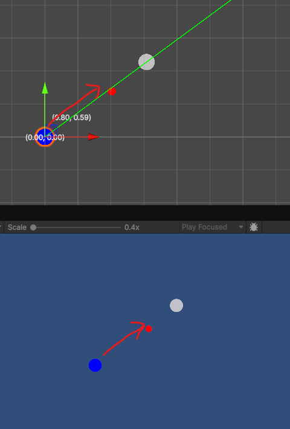</img>

## 06_Collision Contact Point

```csharp
private void OnCollisionEnter2D(Collision2D collision)
{
    ContactPoint2D point = collision.GetContact(0);
    print($"충돌 방향 : {point.normal}");

    if (point.normal.y >= 0.9f)
        print("밑에서 충돌");
    else if (point.normal.y <= -0.9f)
        print("위에서 충돌");

    if (point.normal.x >= 0.9f)
        print("왼쪽에서 충돌");
    else if (point.normal.x <= -0.9f)
        print("오른쪽에서 충돌");
}
```

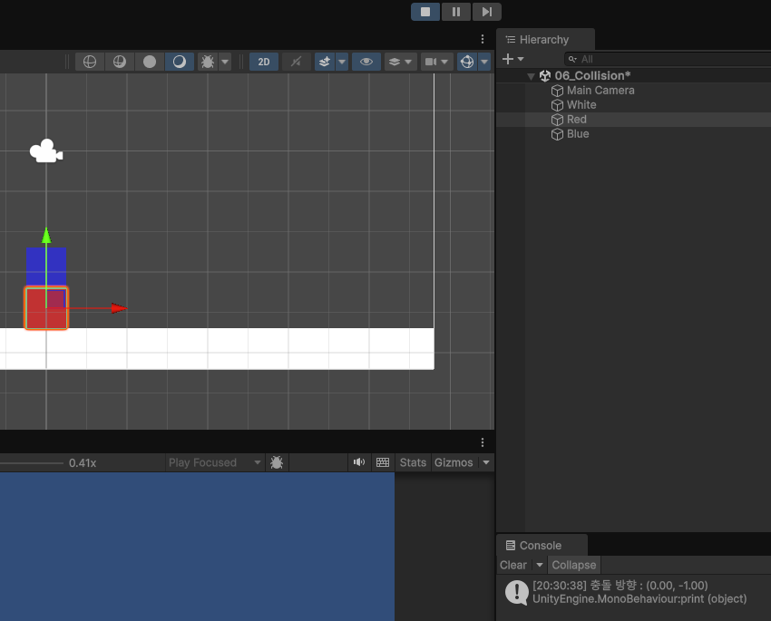</img>

- 레드에 스크립트를 붙이고 출력: 위에서 떨어지는 애와 부딪혔으니까 y가 -1 출력

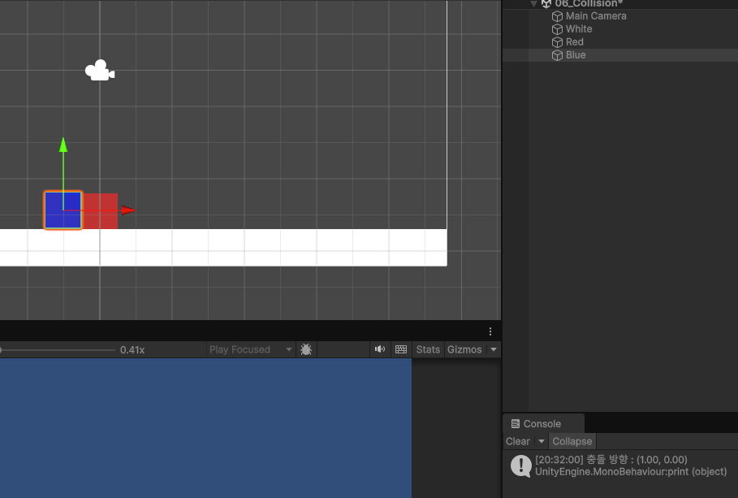</img>

- 왼쪽→오른쪽으로 충돌했기 때문에 x가 1 출력

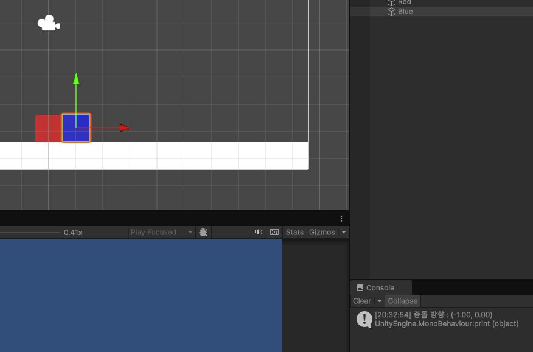</img>

- 오른쪽→왼쪽으로 충돌했기 때문에 x가 -1 출력

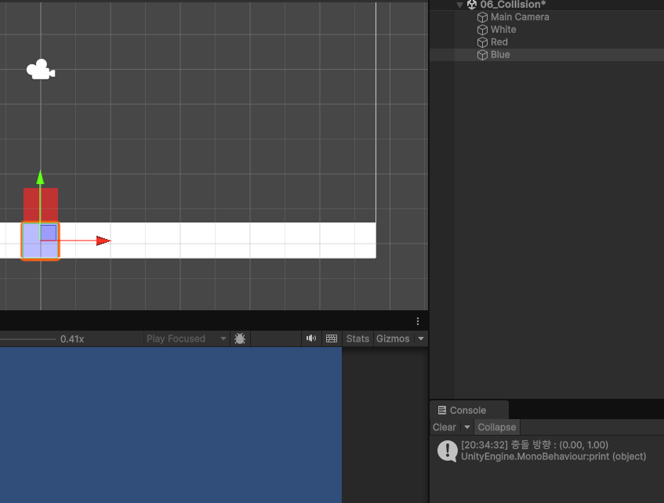</img>

- 아래→위로 충돌했기 때문에 y가 1 출력

## Bounding Box

- 그래픽스 및 물리엔진에서 오브젝트의 충돌 검사나 화면 표시 여부(컬링)를 빠르게 계산하기 위해 물건을 감싸는 바운딩 박스 기법

### AABB(Axis Aligned Bounding Box)

- 특징 : 월드 좌표계의 X, Y, Z축에 항상 평행하게 고정된 상자
- 회전 여부 : 오브젝트가 회전해도 바운딩 박스 자체는 회전하지 않으며, 회전된 오브젝트 전체를 감싸도록 상자의 크기가 실시간으로 재조정됨
- 장점 : 축이 고정되어 있어 단순한 수치 비교만으로 충돌을 판단할 수 있으므로 연산 속도가 극도로 빠름
- 단점 : 대각선으로 기울어진 물체의 경우, 여백 공간(빈 공간)이 커져 정밀한 충돌 검사가 어려움
- 유니티 적용 예시 **:** `Renderer.bounds`나 `Collider.bounds`가 제공하는 Bounds 구조체가 AABB 방식입니다. Frustum Culling(카메라에 보이는지 판별)에 자주 쓰임.

### OBB(Oriented Bounding Box)

- 특징 : 물체의 자체 회전(Local Rotation)에 맞추어 함께 회전하는 상자
- 회전 여부 : 오브젝트가 회전하면 상자도 동일한 방향으로 회전
- 장점 : 물체의 형태에 딱 맞게 감싸므로 여백 공간이 적고 충돌 정밀도가 높음
- 단점 : 분리축 정리(SAT, Separating Axis Theorem) 등 삼각함수와 벡터 연산이 수반되어 AABB에 비해 연산 비용이 높음
- 유니티 적용 예시 : 회전된 `BoxCollider`가 대표적인 OBB 형태